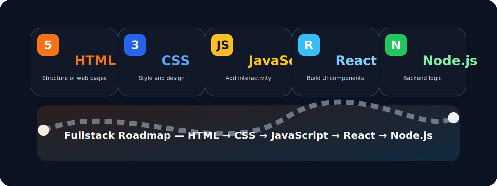

# Fullstack Roadmap



A Remotion-based animation project that visualizes a clean and modern fullstack learning roadmap.

## What it shows

- HTML: structure of web pages
- CSS: style and design
- JS: add interactivity and logic
- React: build UI with components
- Node.js: backend and server logic

## How to run

```bash
npm install
npm start
```

Then open `http://localhost:3000` in your browser.

## Build

```bash
npm run build
```

## Notes

The roadmap image above is included as a local asset at `public/roadmap.svg` and shows the perfect path from frontend basics to backend development.
